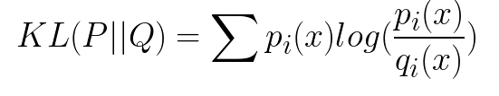
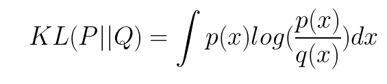
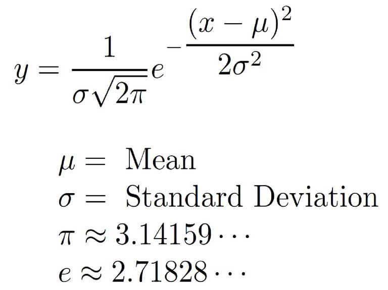

# KL散度（相对熵）python 例子

kl散度我们经常遇到。所以就写了一个kl散度的python的例子。

离散：




连续：



正态分布概率密度函数：



代码实现：

```python
p = tf.placeholder(tf.float64, shape=pdf.shape)
mu = tf.Variable(np.zeros(1))
sigma = tf.Variable(np.eye(1))
normal = tf.exp(-tf.square(x - mu) / (2 * sigma))
q = normal / tf.reduce_sum(normal)
```

demo1.py 为静态的计算kl散度

kld_demo.py 为tensorflow版本的训练的
